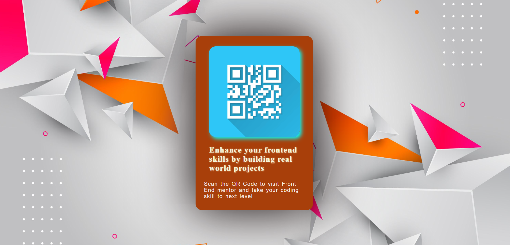

# qr-code-card-ui
💳 A responsive and animated QR Code Card UI built using pure HTML and CSS. Features a stylish background image, hover-based 3D rotation effects, smooth transitions, and an embedded QR image for a modern interactive design.
# QR Code Card UI 🎨

## 🔥 Features

- ✅ Pure HTML and CSS (No JavaScript)
- 📷 QR Code embedded in the card
- 🌀 Hover-based 3D rotation effect
- 🌈 Stylish background image
- ✨ Smooth transitions and animations
- 📱 Mobile responsive design

## 📸 Preview

 

## 🚀 Live Demo

[Click Here to View Live Project](https://atul16dev.github.io/qr-code-card-ui)

## 🛠️ Technologies Used

- HTML5
- CSS3

## 📁 Folder Structure

